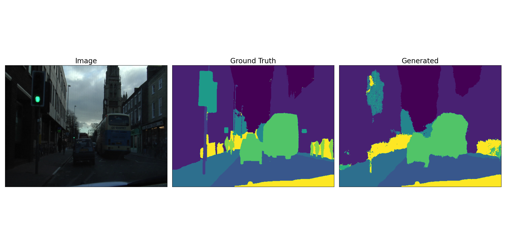
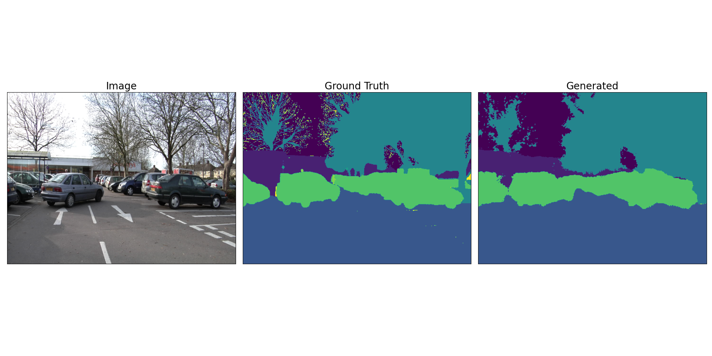

# ENET TF 2.1.1

### Info
 - Dataset : CamVid Sample [link](https://drive.google.com/uc?id=1gt0nCGft0winZqHBYaTb1EL6zM8lrKPA)
 - Classes : 12
 - Trained Epochs : 50
 - Weights : [link](https://drive.google.com/drive/folders/1JuJwsZt9FlsWsky_3hcgmZDq8NFgLdt4?usp=sharing)

### Train & Evaluation
  - Training Enet
  ```python
    python train.py --data_location your_location_of_data
  ```
  - Evaluate Stored Model
  ```python
    python test.py
```

### Results
### Output 1

### Output 2

### Output 3

### Output 4

